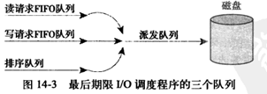

<!-- TOC -->

- [Linux机械硬盘I/O优化技术](#linux机械硬盘io优化技术)
    - [一、I/O调度程序](#一io调度程序)
        - [1、I/O调度的必要性](#1io调度的必要性)
        - [2、Linus电梯](#2linus电梯)
        - [3、最后期限I/O调度程序](#3最后期限io调度程序)
        - [4、预测I/O调度程序](#4预测io调度程序)
        - [5、完全公正的排队I/O调度程序](#5完全公正的排队io调度程序)
        - [6、空操作的I/O调度程序](#6空操作的io调度程序)
    - [二、页高速缓存和页回写](#二页高速缓存和页回写)
        - [1、磁盘高速缓存的重要性](#1磁盘高速缓存的重要性)
        - [2、Linux页高速缓存](#2linux页高速缓存)
        - [3、页写回](#3页写回)

<!-- /TOC -->
## Linux机械硬盘I/O优化技术
### 一、I/O调度程序
#### 1、I/O调度的必要性
机械硬盘是一种**块设备**，区别于字符设备，系统能够随意地从一个位置跳转到另一个位置，即随机地访问固定大小的数据片。如果简单地以内核产生请求的次序直接将请求发给块设备的话，系统将花费许多时间在寻址上，而磁盘寻址是整个计算机中最慢的操作之一，我们如果想要提高系统性能，就要尽量缩短寻址时间。

为了优化寻址操作，内核既不会简单地根据请求接收次序，也不会立即将其提交给磁盘，相反，在提交之前，内核会先调用I/O调度程序，执行合并与排序的预操作，决定请求队列中的排列顺序以及什么时候派发请求到块设备，从而提高全局吞吐量。

#### 2、Linus电梯
**Linus电梯** 是`2.4`版内核中默认的I/O调度程序，其主要功能就是执行合并与排序的预处理。当一个请求加入队列中时，有可能发生四种操作：
- 合并：如果队列中已存在一个对相邻磁盘扇区操作的请求，那么新请求将和这个已经存在的请求合并成一个请求。
- 排序：如果合并尝试失败，将会寻找队列中以扇区方向为序合适的插入位置，将新请求插入到该位置，保证队列中的请求是以被访问磁盘物理位置为序进行排列的。
- 如果队列中不存在合适的请求插入位置，则插入到队列尾部。
- 如果发现队列中存在一个驻留时间过长的请求，那么新请求也会被插入队列尾部，并且插入后还要排序，避免由于访问相近磁盘位置的请求太多，导致饥饿发生。

#### 3、最后期限I/O调度程序
**最后期限I/O调度程序**是为了解决Liunx电梯所带来的**饥饿问题**而提出的，特别是减少读请求饥饿现象。

在内核中，**写操作通常是异步的，而读操作是同步**，也即：当应用程序提交一个读请求时，应用程序会阻塞直到读请求返回，因此读操作对系统性能的影响更大。而且，读请求往往还会相互依赖。

比如，使用`while(read(fd,line,1024))`来一行一行读取并处理大文件，每次都只读取一块很小的缓冲区，只有将上一个数据区从磁盘中读取并返回之后，才能继续读取下一个数据区，如果每一次请求都发生饥饿现象，那么对读取文件的应用程序来说，全部延迟加起来会造成过长的等待时间。因此，最后期限I/O调度程序既需要尽量提高全局吞吐量，又要使请求得到公平处理。

为此，最后期限I/O调度程序采用如下三个队列：

- 首先，在最后期限I/O调度程序中，每个请求都有一个**超时时间**。
- 其次，读请求和写请求的超时时间不同，默认读请求的超时时间是 500ms，写请求超时时间 5s，因此需要**为读请求和写请求各自单独维护一个FIFO队列**。排序队列与Linus电梯相同，用于执行新请求的并与插入。这样，派发一个请求时，可能有如下两种操作：
    - 正常情况下，将请求从排序队列的头部摘下，推入到派发队列中，然后再由派发队列将请求提交给磁盘驱动，从而保证最小化的请求寻址。
    - 如下写/读请求FIFO队列头的请求超时，将从FIFO队列中提取请求进行服务，由此就解决饥饿问题。

    需要注意的是，最后期限I/O调度算法并不能严格保证请求的相应时间，但是通常情况下，可以在请求超时或超时之前提交和执行，以防止请求饥饿现象的发生。并且，由于读请求给定的超时时间要比写请求短许多，所以可以确保写请求不会因为阻塞读请求而发生读请求饥饿现象，确保读相应时间尽可能短。

#### 4、预测I/O调度程序
考虑如下最后期限I/O调度程序带来的问题：
> 假设系统需要频繁提交写请求，但每次有读请求提交时，调度程序都会迅速处理读请求，先为读请求寻址，执行读操作，然后再返回执行写操作，这样就需要两次寻址操作，并且对每个读请求都是如此。

这种做法对读请求来说是好事，却降低的系统的全局吞吐量。**由此提出了既可以保持良好读响应又能提供良好的全局吞吐量的预测I/O调度程序**。

预测I/O调度，顾名思义，就是具有预测启发的能力，其他则与最后期限I/O调度程序相同。**其核心思想是：要减少在进行I/O操作期间，处理新到的请求所带来的寻址开销。**

由此，它的工作流程是：在请求提交后，不直接返回处理其他请求，而是有意地停留片刻，如 6ms，在这 6ms 期间，任何对相邻磁盘位置操作的请求都会立刻得到处理。在等待时间结束后，再重新返回原来的位置，继续执行以前剩下的请求。

至于这个等待时间长短的确定，需要预测I/O调度程序跟踪并统计每个应用程序块I/O操作的习惯行为，才能正确预测应用程序和文件系统的行为。如果预测准确率高，就能在减少读相应时间的同时，又能减少寻址次数和时间。

#### 5、完全公正的排队I/O调度程序
**队列维护情况**：在完全公正的排队I/O调度程序（即CRQ）中，每一个提交I/O的进程都有自己的队列。例如，来自foo进程的I/O请求进入foo队列，来自bar进程的I/O请求进入bar队列。在每个队列中，也要进行合并与排序。

**在调度时**：CFQ I/O调度程序以时间片轮转调度，从每个队列中选取请求数（默认为4），然后进行下一轮调度，由此做到了进程级别的完全公平。

#### 6、空操作的I/O调度程序
顾名思义，空操作I/O调度程序既不对请求进行排序，也没有预寻址操作。不过它还是执行了合并操作，对于随机访问设备，比如SSD，就没有寻道的负担，也就不用进行插入排序，**因此空操作的I/O调度程序是专为随机访问设备（而不是机械硬盘）设计的。**

### 二、页高速缓存和页回写
#### 1、磁盘高速缓存的重要性
在上一小节I/O调度程序中，我们讨论了有多个请求需要对磁盘进行I/O操作时，如何提高系统的性能。在这一小节中，我们将讨论如何**减少对磁盘的I/O操作。**

**页高速缓存（cache）** 简单来讲就是，将磁盘中的数据缓存到物理内存中，把对磁盘的访问变为对物理内存的访问。这样做的原因基于两个事实：
- 访问内存要比访问磁盘速度快很多（ ns 和 ms 的差距）。
- 局部性原理，数据一旦被访问，就很有可能在短期内再次被访问到。如果在第一次访问数据时缓存它，就极有可能在短时间内再次被高速缓存命中。

#### 2、Linux页高速缓存
页高速缓存包含的是最近被访问过的文件的数据块，它来自对普通文件、块设备文件和内存映射文件的读写。**总的来说，系统在执行一个I/O操作之前，会检查数据是否已经在页高速缓存中，如果是，则可以从内存中迅速地返回需要的页，而不再需要从相对较慢的磁盘上读取数据。**

Linux页高速缓存使用了一个`address_space`对象来管理缓存项和页I/O操作。以下讨论进行读操作和写操作时页高速缓存的工作流程。

**在进行读操作时**，内核会先通过`find_get_page()`这个方法来检查能否在页高速缓存中找到需要的数据（需要告诉它指定的地址空间与偏移量），如果搜索的页没有在高速缓存中，该方法将会返回一个`NULL`，并且内核将调用`page_cache_alloc_cold()`分配一个新页面，然后调用`add_to_page_cache_lru`将之前搜索的页加入到高速缓存中。最后，将需要的数据从磁盘读入，再被加入页高速缓存，然后返回给用户。

**在进行写操作时，**当页被修改了，只要调用`SetPageDirty(page)`，然后内核就会在晚些时候通过`writepage()`方法将页写出。写出时，先在页高速缓存中搜索需要的页，如果不在页高速缓存中，那么内核在高速缓存中新分配一空闲项；接着，内核创建一个写请求，然后数据被从用户空间拷贝到内核缓冲，最后将数据写入磁盘。其实，对于写操作，页高速缓存更像是一个存储平台，所有要被写出的页都要加入页高速缓存。

从上述过程中可以看出，任何页I/O操作前内核都要检查页是否已经在页高速缓存中了，所以这种频繁进行的检查必须迅速、高效。

在`2.6`版本之前，内核通过维护系统中所有页的全局散列表进行检索。在`2.6`版本中则是通过基树（`radix tree`,是一棵二叉树）来实现。每个`address_space`对象都有唯一的基树，保存在`page_tree`结构体中。在检索时，`find_get_page()`会根据指定的`address_space`对象，调用`radix_tree_lookup()`(调用时指定文件偏移量)，然后就可以中迅速检索到需要的页。

#### 3、页写回
由于页高速缓存的缓存作用，会出现 **脏数据** ，即页高速缓存中的数据比磁盘中存储的数据更新。我们必须找时机延迟写到磁盘中。三种时机如下：
- 空闲内存低于一个特定的阈值（为了清理缓存，释放内存）；
- 脏页在内存中驻留时间超过了一个特定的阈值（为了确保脏页不会无限期驻留在内存中）；
- 当用户进程调用`sync()`和`fsync()`系统调用，内核按要求执行回写动作。

    在2.6内核中，由`Flusher`内核线程负责页写回工作，具体如下：
    - 当可用物理内存过低时，调用`flusher_threads()`唤醒一个或多个`flusher`线程，随后`flusher`线程进一步调用`bdi_writeback_all()`开始将脏页写回磁盘，直到已经有指定的最小数目的页被写出到磁盘或者空闲内存数已经回升到超过某个阈值。
    - 为了确保脏页不会无限期驻留在内存中，`flusher`线程后台例程会被周期性唤醒。系统在启动时，内核会初始化一个定时器，让它周期地唤醒`flusher`线程，随后使其运行`wb_writeback()`函数，把所有驻留时间超过`dirty_expire_interval_ms`的脏页写回。

