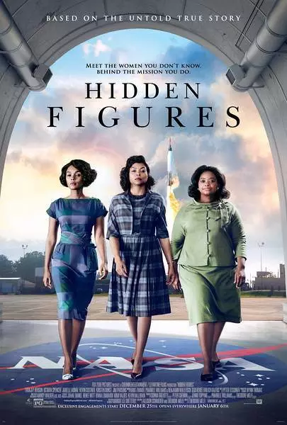

### 《Hidden Figures》

#### 1、即使之前从来没有过 It's Never Been Done Before
 > *Paul Stafford:* There is no protocol for women attending.

> *Katherine Johnson:* There's no protocol for a man circling the earth either, sir.

---
> *Mary Jackson:* Mr. Zielinski, I’m a Negro woman. I’m not going to entertain the impossible.

> *Karl Zielinski:* And I’m a Polish Jew whose parents died in a Nazi prison camp. Now I’m standing beneath a spaceship that’s going to carry an astronaut to the stars. **I think we can say we are living the impossible.** Let me ask you, if you were a white male, would you wish to be an engineer?

> *Mary Jackson:* I wouldn’t have to, I’d already be one.

---
> *Mary Jackson:* I can’t change the color of my skin. So I have no choice but to be the first. Which I can’t do without you, sir. 

#### 2、不公
> *Mary Jackson:* Every time we get a chance to get ahead they move the finish line, every time.

#### 3、机会是留给有能力、有准备的人
> *Jim Johnson:* You're a computer at NASA. They let women handle that sort of...?

> *Katherine Johnson:* Yes, they let women do some things at NASA, Mr. Johnson, and **it's not because we wear skirts. It's because we wear glasses.**

---

> *Dorothy Vaughn:* My gals are **ready**. We can do the work.

