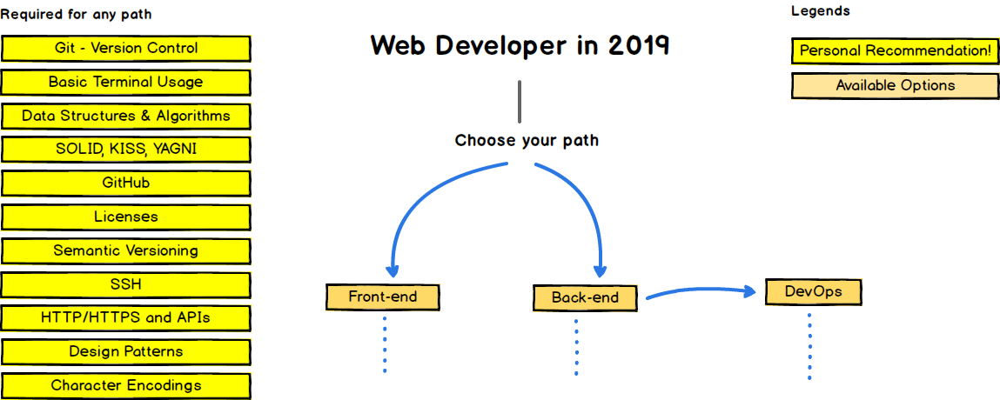
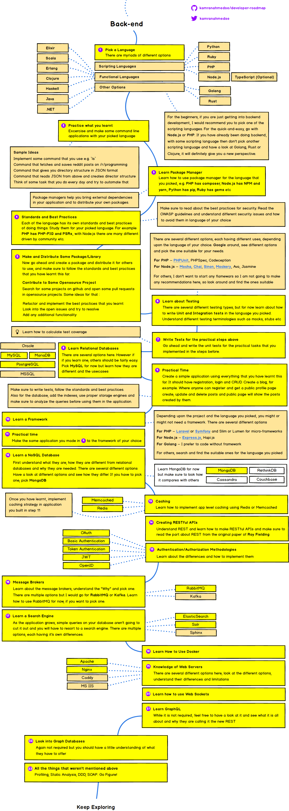
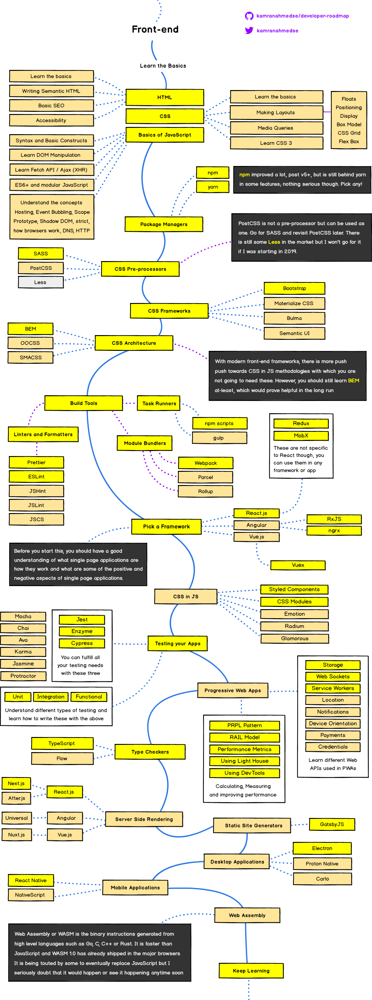
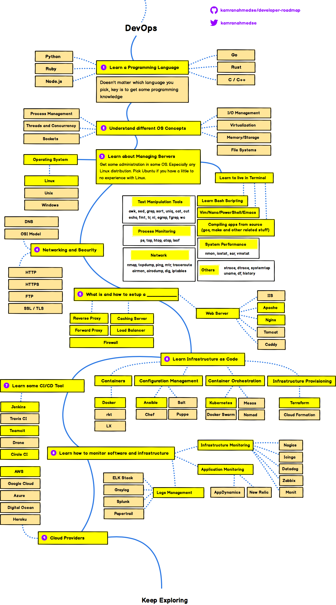

# 1

## [程序员如何在技术浪潮的更迭中保持较高的成长速度 ？](https://halfrost.com/halfrost_2017/)
- **大量的项目实践 + 主动有目的的看书学习 + 有大神指点 = 高效的学习**  
在公司的项目里面去实践是成长最快的。

> 程序员如何在技术浪潮的更迭中保持较高的成长速度 ？我的答案就是在公司的项目里面去实践是成长最快的。首先业务的迭代排期会让你的学习不拖拉，在排期中必须要完成指定的任务，这对学习进度有了非常好的保证。其次，实际项目中的实践能让你对语言的熟练程度，语言的生态环境，开发过程，查找 bug 流程，监控各个方面都有实践经验。而且实际项目中还能让你遇到各式各样的坑，坑踩多了就成长了。正确的学习方式也应该是将学习与具体业务场景结合起来，帮助公司利用自己掌握的技术开展业务服务而创造价值。如此看来，这样的成长一定是最快的。
- 迷茫的来源：看不到自己对公司的价值、看不到自己未来发展的路

---

- 关于业务和架构，最终的价值都是替公司赚钱，所有公司都需要有写业务的。架构：看到业务痛点，理解业务痛点、开发提供痛点方案，来源于对公司业务的深刻理解与深厚的技术积累。没有最好的架构，只有最适合的架构。

> 公司把一个业务交给你，你是否能按时高效的交付是你当前需要考虑的问题。当你对当前业务玩的很溜了，对这块有深刻理解了。可以再去考虑理解去理解你所在的产品线，这一条业务线的流程。在理解流程的同时去考虑当前公司的架构设计为何如此设计？有什么优点有什么缺点？哪些能改哪些不能改，哪些是历史遗留问题造成的？

> 只有这样日积月累的积累，当你积累了大量业务经验，以及大量业务场景下优秀合理的架构设计以后，你就能向着架构师的方向前进了。

> 架构师的工作是以解决业务问题，推动业务增长为基础，在此之上改善公司的架构，使之能对外提供更加优秀的性能，并具有对人、技术、业务的组织统筹能力。

> 一个好的产品，一定是能完美解决用户痛点的。如何理解和发现业务的价值也是一种能力。

> 视野不应该仅仅局限在自己的开发语言中。可以超脱开发语言，放开视野，从更高层次去想想问题。

---

> 提问：作为一个后端开发，如何去提高自己的驾驭复杂业务逻辑的能力、设计能力和抽象能力？如果接手一个稳定性不够好的系统，如何收敛复杂度，逐步提高稳定性？

> 答：驾驭首先要做到通晓。了解所有业务逻辑的来龙去脉，知道一些典型系统设计方案以及其针对的问题，还有优劣比较。接触过一些实际的系统。在此之上，才有可能把合适的设计套用到当前的业务逻辑上，把现有的业务逻辑抽象成一个已经存在（部分）解决方案，或更经典的方式。

>接手一个稳定性不好的系统，如果没有足够的时间从头设计、完全重构。那么至少要知道影响稳定性的几个关键要素，然后根据重要性、紧急性和解决问题需要的资源（时间、技能集、人等）进行优先级排序，逐个击破。对于所有的改善型动作，确保有适合的评测和监控，这样能够知道不同的措施效果到底是怎么样的。

## [如何看待软件开发 ？](https://halfrost.com/halfrost_2018/)
- 软件开发是一种人类思维活动的体现 : 思考问题的角度和快速解决问题的能力。

> “毕业前 5 年(最长 5 年)，建议开发的各个方向都多多尝试尝试，找到自己真正感兴趣方向，一旦找到这个方向以后，埋下头来钻进去 3-5 年”. **第一技能一定要专精。**

- 关于技术换方向：

  - 不到万不得已，别换方向。新的方向上你是新人，一切都要重头开始，换了方向以后，晋升和跳槽都比较麻烦！
  - 如果为了换方向而跳槽，那么换工作不要降薪降职，薪水一样的情况下职级越低越好。
  - 换方向以后，心态需要调整，你在原来方向上可能是大爷，但是新的方向上，安心先做 2 年孙子吧。
  - 在新的方向上，要给自己信心，信心比黄金更重要，行业即使寒冬，也要坚持锻炼身体，身体是革命的本钱。要在新的方向上做好时间规划。
  - 如果换了方向以后，职级还能提高了，请做好心理准备，牢记：欲戴皇冠，必承其重 ！迎接挑战吧。
  - 顺应趋势可能比努力更重要。

- 小公司被大公司收购以后，影响最大的是小公司的基础设施,收购影响最小的是核心开发业务团队。

> 如果想成为被大公司抢着“挖”的香饽饽，据我观察主要有这么 2 类人。一类是把一个领域做到极致，做到 95，甚至 99，100 分，一提到他就代表了这个领域或者方向，他是这个领域的领袖和领军第一人，成为这样的人很不容易。这种人对应的 title 就是 XXX 高级技术专家。另一类人是把某个产品做到极致。比如 APM，质量监控，容器调度，SOA，CI/CD，云基础设施等等。或者是公司某块业务了然于胸，微信和钉钉的 IM 核心开发，淘宝天猫京东的交易系统核心开发等等。这些人也会被争相被挖。乍一看后面一种人也许技术研究方面只有 85 分或者 90 分，但是业务熟练度上面分数更高。

# 《不止代码》阅读笔记

### 误区
1、拜大牛为师

大牛很忙，单独给你开小灶不太可能，而团队培训很耗时间。因此找大牛，要带着问题去请教或探讨。并且，技术大牛不多。大部分时间时间还是靠自己系统性、有针对性的提升。

2、关于业务代码

业务代码都写不好的程序员肯定无法成为技术大牛，但只把业务代码写好的程序员也还不能成为技术大牛。

写好业务代码比如可以使用封装和抽象使得业务代码更具可扩展性，可以通过和产品多交流以便更好的理解和实现业务，日志记录好了问题定位效率可以提升 10 倍等等。

但跟游戏中升级打怪一样，这只是一个比较初级的挑战。要通过应对更大的挑战使自己水平更上一级，如此往复。

需要 **Do more**,熟悉更多业务（需求分析、问题处理、方案设计），熟悉端到端，需要自学（唯一不变的只有变化）

需要 **Do better**、**Do exercise**(learning(基础性的东西先完整看一本书全面了解再google等)、trying、teaching。

