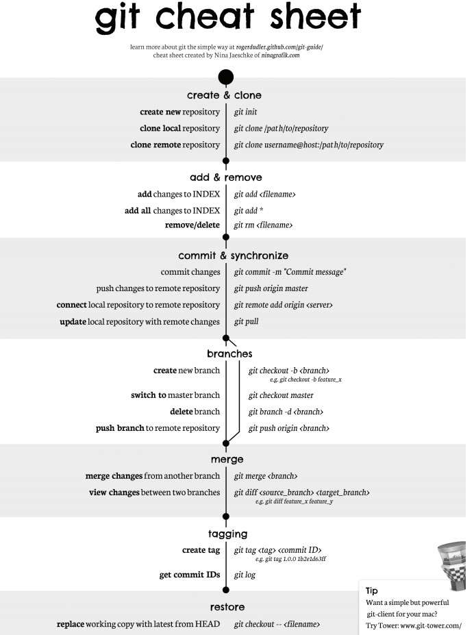
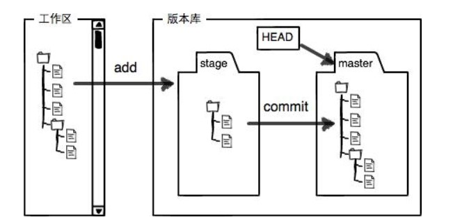
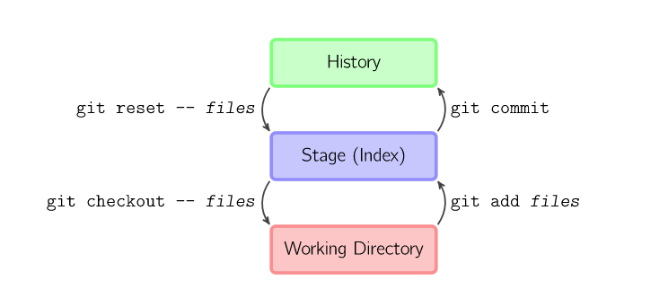
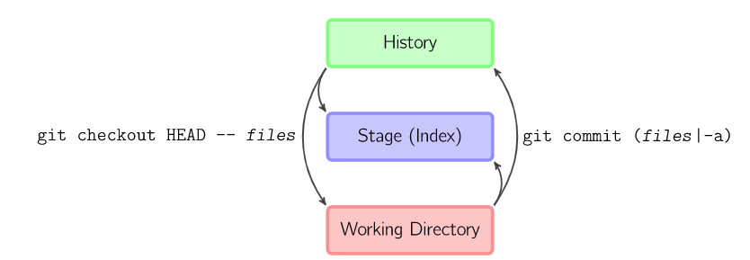
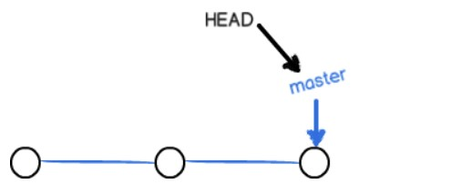
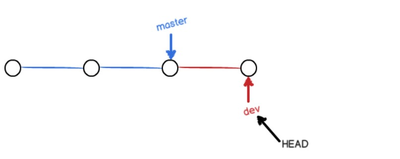
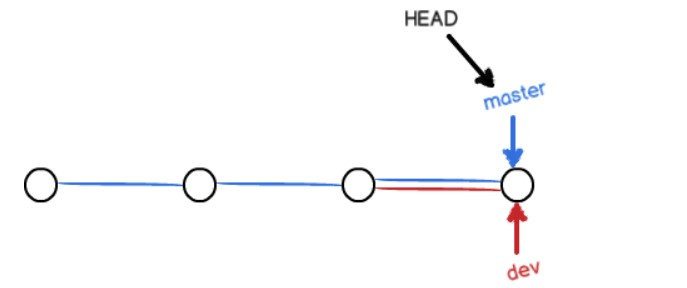
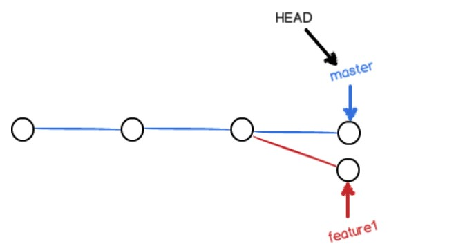
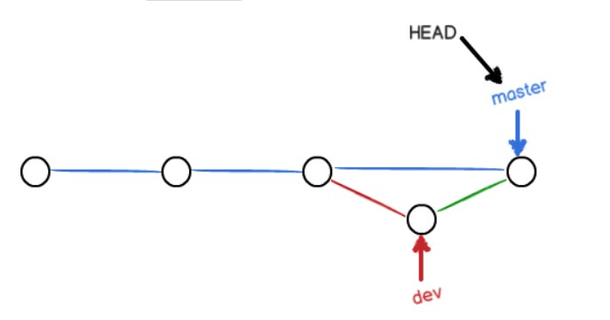

<!-- TOC -->

- [参考资料](#参考资料)
- [Git 命令一览](#git-命令一览)
- [分布式与集中式 (Git 与 SVN)](#分布式与集中式-git-与-svn)
- [工作流](#工作流)
- [分支实现与冲突合并](#分支实现与冲突合并)
- [储藏（Stashing）](#储藏stashing)

<!-- /TOC -->

## 参考资料
将参考资料放到了最前面，便于直接查阅。

- [Git - 简明指南](http://rogerdudler.github.io/git-guide/index.zh.html) (简明易懂，页面漂亮)
- [Learn Git Branching](https://learngitbranching.js.org/)（在沙盒里执行 Git 命令，能看到每个命令的执行情况； 关卡挑战模式，可以动手，学习起来也比较有意思）
- [图解 Git](http://marklodato.github.io/visual-git-guide/index-zh-cn.html)（可以更透彻理解 Git 的工作原理）
- [廖雪峰 : Git 教程](https://www.liaoxuefeng.com/wiki/0013739516305929606dd18361248578c67b8067c8c017b000)

## Git 命令一览



## 分布式与集中式 (Git 与 SVN)

**Git** 属于分布式版本控制系统，每个人的电脑上就有一份完整的代码。控制新建分支、合并分支操作速度非常快。

**SVN** 属于集中式版本控制，只有中心服务器拥有一份代码，新建一个分支相当于复制一份完整代码。

**SVN 缺点：**

1、有安全性问题，中心服务器挂了所有人都没办法工作了。

2、需要连网才能工作，如果网速过慢，提交一个文件就会很慢。而分布式版本控制不需要连网就能工作。

**中心服务器：**
中心服务器用来交换每个用户的修改，没有中心服务器也能工作，但是中心服务器能够 24 小时保持开机状态，这样就能更方便的交换修改。Github 就是一个中心服务器。

## 工作流



新建一个仓库之后，当前目录就成为了工作区，工作区下有一个隐藏目录 .git，它属于 Git 的版本库。

Git 版本库有一个称为 stage 的暂存区，还有自动创建的 master 分支以及指向分支的 HEAD 指针。



- `git add files` 把文件的修改添加到暂存区
- `git commit` 把暂存区的修改提交到当前分支，提交之后暂存区就被清空了
- `git reset -- files` 使用当前分支上的修改覆盖暂存区，用来撤销最后一次 git add files
- `git checkout -- files` 使用暂存区的修改覆盖工作目录，用来撤销本地修改



可以跳过暂存区域直接从分支中取出修改，或者直接提交修改到分支中。

- `git commit -a` 直接把所有文件的修改添加到暂存区然后执行提交
- `git checkout HEAD -- files` 取出最后一次修改，可以用来进行回滚操作

## 分支实现与冲突合并

**分支实现**

使用指针将每个提交连接成一条时间线，HEAD 指针指向当前分支指针。



新建分支是新建一个指针指向时间线的最后一个节点，并让 HEAD 指针指向新分支表示新分支成为当前分支。


每次提交只会让当前分支指针向前移动，而其它分支指针不会移动。



合并分支也只需要改变指针即可。



**冲突**

当两个分支都对同一个文件的同一行进行了修改，在分支合并时就会产生冲突。



Git 会使用 <<<<<<< ，======= ，>>>>>>> 标记出不同分支的内容，只需要把不同分支中冲突部分修改成一样就能解决冲突。

```
<<<<<<< HEAD
Creating a new branch is quick & simple.
=======
Creating a new branch is quick AND simple.
>>>>>>> feature1
```

**Fast forward**

**"快进式合并"（fast-farward merge）**，会直接将 master 分支指向合并的分支，这种模式下进行分支合并会丢失分支信息，也就不能在分支历史上看出分支信息。

可以在合并时加上 --no-ff 参数来禁用 Fast forward 模式，并且加上 -m 参数让合并时产生一个新的 commit。

```
$ git merge --no-ff -m "merge with no-ff" dev
```



**分支管理策略**

master 分支应该是非常稳定的，只用来发布新版本；

日常开发在开发分支 dev 上进行。

## 储藏（Stashing）

在一个分支上操作之后，如果还没有将修改提交到分支上，此时进行切换分支，那么另一个分支上也能看到新的修改。这是因为所有分支都共用一个工作区的缘故。

可以使用 git stash 将当前分支的修改储藏起来，此时当前工作区的所有修改都会被存到栈上，也就是说当前工作区是干净的，没有任何未提交的修改。此时就可以安全的切换到其它分支上了。

```
$ git stash
Saved working directory and index state \ "WIP on master: 049d078 added the index file"
HEAD is now at 049d078 added the index file (To restore them type "git stash apply")
```

**该功能可以用于 bug 分支的实现。如果当前正在 dev 分支上进行开发，但是此时 master 上有个 bug 需要修复，但是 dev 分支上的开发还未完成，不想立即提交。在新建 bug 分支并切换到 bug 分支之前就需要使用 git stash 将 dev 分支的未提交修改储藏起来。**


